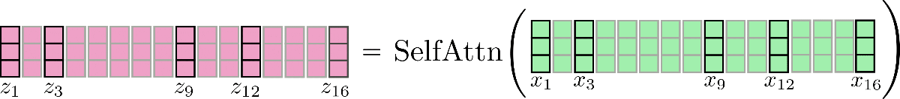
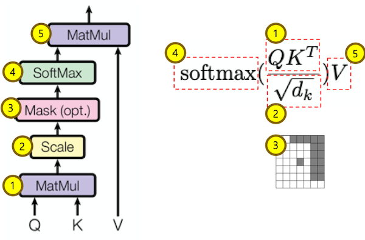
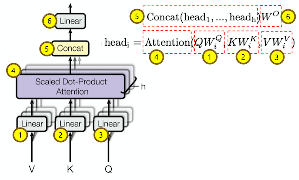
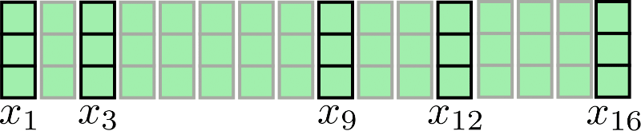
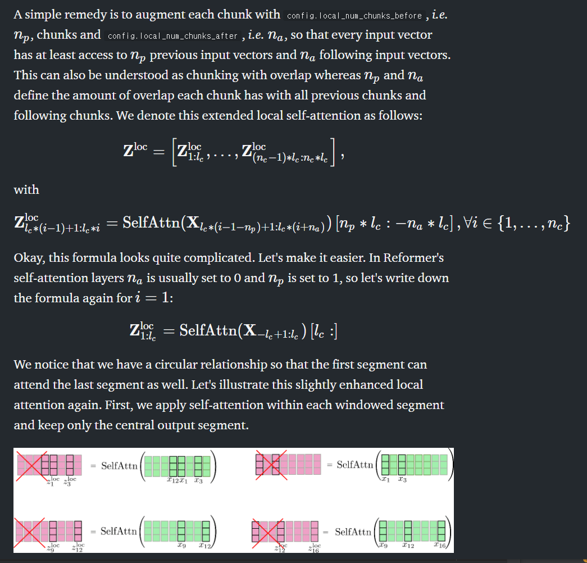
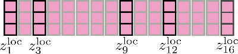

# The Reformer

## How the Reformer uses less than 8GB of RAM to train on sequences of half a million tokens

해당 글은 [Huggingface blog](https://huggingface.co/blog/reformer) 및 [REFORMER: THE EFFICIENT TRANSFORMER](https://arxiv.org/pdf/2001.04451.pdf) 를 보고 정리한 것입니다. 주로 정리가 잘 되어있는 Huggingface를 보겠지만 논문도 같이 보면서 정리합니다. 국어 못함. 영어 못함. 해당 글의 목적은 본인이 바로 이해할 수 있도록 하는 것.

* Long Sequence length를 고려해 입력을 제한하지 않고도 학습이 가능한 모델 구조가 발표되고 있다.
* 그중 [Reformer model](https://arxiv.org/pdf/2001.04451.pdf)는 구글에서 발표한 것으로 시간복잡도를 O(L<sup>2</sup>)에서 O(L log L)로 줄일 수 있다고 설명한다. 또한, reversible residual layer를 사용하여 standard residuals를 사용했을 때 N layer에서 N시간이 걸리는 학습 시간을 단 한번에 가능하다고 한다(이부분은 더 읽어봐야 알 것 같다.)
* Reformer은 성능의 큰 하락없이 long sequence 학습에 memory-efficient와 much faster 를 제공한다. (국어랑 영어 다못해서 이렇게 적음)

**Reformer**는 크게 4가지 특징이 있다.

1. **Reformer Self-Attention Layer** - Local context에 제약받지 않고 효율적인 self-attention이 가능할까?
2. **Chunked Feed Forward Layers** - *How to get a better time-memory trade-off for large feed forward layers?*(해석안되서 영어로)
3. **Reversible Residual Layers** - smart residual architecture로 학습 과정에서 memory consumption을 줄일 수 있는가?
4. **Axial Positional Encodings** - extremely large input sequence를 사용할 수 있는 positional encodings를 어떻게 해야 하는가?

Axial Positional Encodings는 `Refomer`논문에 제대로 작성이 되어있지 않다고 한다. 하지만 huggingface blog에는 해당 방법을 first in-depth 설명을 해준다고 한다. 

## 1. Reformer Self-Attention Layer

* Reformer는 *local* self-attention layer 와 Locality Sensitive Hashing(LSH) self-attention layers를 사용한다.

### Recap Global Self-Attention



여기서 `batch_size = 1` , `num_attention_heads = 1`로 간주하였다. 해당 그림이 일반적인 Global Self Attention을 표현한 것이다. 

부가설명

해당 부분은 `Huggingface Transformer` 구현 코드로 설명하면 쉬울 것 같아서 가져온다.





```python
# Transfomer Attention Class forward 부분
# 해당 연산에서 직관성을 위해 batch_size = 1, sequence_length = 128, embedding size=768, head = 12로 생각하고 작성하였다.
  def forward(self, x, layer_past=None, attention_mask=None, head_mask=None):
    # x: 입력값(1, 128, 768)
    # multi_head_attention 1,2,3번을 한번에 계산
    x = self.c_attn(x) # (1, 128, 768*3) Q, K, V를 한번에 계산
    query, key, value = x.split(self.split_size, dim=2) # (1, 128, 768) * 3
    # query를 헤드 갯수만큼 쪼개준다. (1, 12, 128, 64)
    query = self.split_heads(query) 
    key = self.split_heads(key, k=True) # query size와 같음. QK^T를 위해 미리 transpose
    value = self.split_heads(value)
    if layer_past is not None: # 해당 부분은 Transformer encoder/decoder 연결을 위해 있는건가?(잘모름)
      # transpose back cf below
      past_key, past_value = layer_past[0].transpose(-2, -1), layer_past[1]
      key = torch.cat((past_key, key), dim=-1)
      value = torch.cat((past_value, value), dim=-2)
    # transpose to have same shapes for stacking
    present = torch.stack((key.transpose(-2, -1), value))

    attn_outputs = self._attn(query, key, value, attention_mask, head_mask) # scale dot product attention 수행
    a = attn_outputs[0] # (1, 12, 128, 64)
	# multi head attention 5 concat 수행
    a = self.merge_heads(a) # (1, 128, 768)
    # multi head attention 6번 linear 수행(transformer에서는 Conv1D 함수로 구현됨)
    a = self.c_proj(a) # (1, 128, 768)
    a = self.resid_dropout(a)

    outputs = [a, present] + attn_outputs[1:]
    return outputs  # a, present, (attentions)
```

* 해당 부분에서 `Dot Product` **QK<sup>T</sup>**를 계산해야 하기 때문에 공간복잡도가 O(n<sup>2</sup>)*이 되어 sequence_length를 크게 잡기가 힘들다. 

### Local Self-Attention

O(n<sup>2</sup>)의 공간복잡도를 줄일 수 있다. 이를 위해 **X** = **X<sub>1:n</sub>** = x<sub>1</sub> ......., x<sub>n</sub>을 n<sub>c</sub> chunks 기준으로 cut 하여 다음과 같이 만들 수 있다. [**X<sub>1:*l*<sub>c</sub></sub>**, ........ **X<sub>(n<sub>c</sub>-1) * *l*<sub>c</sub> : n<sub>c</sub> * *l*<sub>c</sub></sub>**] 여기서 ***l<sub>c</sub>***는 `chunk_length`로 한 chunk당 몇개를 가지고 있는가를 나타내는 지표이다.




입력 **X**(embedding_size = 3, sequence_length = 16)

다음은 파라미터 값을 *n<sub>c</sub>*=4, *l<sub>c</sub>*=4로 했을 경우의 그림이다.


그림에서 보이는 것처럼 몇몇 값은 인접했던 벡터와 access가 없는 것을 확인할 수 있다. 이것은 problematic 하다. 그 이유는 tokens가 다른 word representations를 학습하지 못하기 때문이다.(국어영어 못함)



* 수식은 매우 복잡하지만 결국 chunked attention을 수행할 때 현재 chunk_length 보다 길게 잡은 후 self-attention을 수행하고 앞부분을 자르겠다는 것이다. 위 그림은 일반적으로 사용되는 n<sub>a</sub>=0, n<sub>p</sub>=1로 했을 경우의 예시이다. 
* (주저리)그림 좌측상단 SelfAttn이 적용되는 부분 *x<sub>12</sub>*는 그림이 잘못된 것 같음. *x<sub>13</sub>*....*x<sub>16</sub>*인것 같은데.........



결국 최종값은 다음 그림과 같을 것이다.

Local self-attention은 효율적으로 수행되었기 때문에 output는 계산되지 않고 위 X로 표시된 것처럼 버려질 것이다.(?)

> Note that local self-attention is implemented efficiently way so that no output is computed and subsequently "thrown-out" as shown here for illustration purposes by the red cross.

여기서 중요한 점은 각각의 chunked self-attention function의 크기를 늘리면(chuncked vector의 sequence를 더 키운다는 소리인것 같음) 각 출력 **z<sub>i</sub>**는 better vector representations을 학습할 수 있을 것이다. 예를 들어, z<sub>5</sub><sup>loc</sup> ~ z<sub>8</sub><sup>loc</sup>은 to learn better representations하기 위해 **X<sub>1:8</sub>**의 정보를 가지고 있을 것이다(이부분은 마음대로 해석)

Memory consumption은 O(n<sup>2</sup>)에서 O(n<sub>c</sub> * l<sub>c</sub><sup>2</sup>)=O(n * l<sub>c</sub>)로 줄었다. => n이 sequence_length이니까 global self-attention은 dot-product시 O(n<sup>2</sup>)일 것이다. chunks의 갯수는 n<sub>c</sub>이고 각 chunk의 길이(sequence_len보다는 작을 것이다)인 *l<sub>c</sub>*이므로 공간복잡도는 감소할 것이다.

이렇게 발전된 local self-attention은 vanilla local self-attention보다 좋은 구조이지만 predefined size의 local context에서만 attention을 하는 단점이 있다. 

> For NLP tasks that do not require the transformer model to learn long-range dependencies between the input vectors, which include arguably *e.g.* speech recognition, named entity recognition and causal language modeling of short sentences, this might not be a big issue.

Transformer model이 필요없는 NLP task에서는 input vectors 사이의 long-range dependencies를 learn한다. 특히 짧은 문장을 학습하는 경우에는 더욱.(원문을 보자) 많은 NLP tasks는 long-range dependencies를 학습해야 하므로 local self-attention은 상당한 성능 저하를 야기시킬 수 있다. 예를 들면,

* Question-answering: model은 question token과 relevant answer token이 local range에 거의 있지 않더라도 관계를 학습해야 한다.